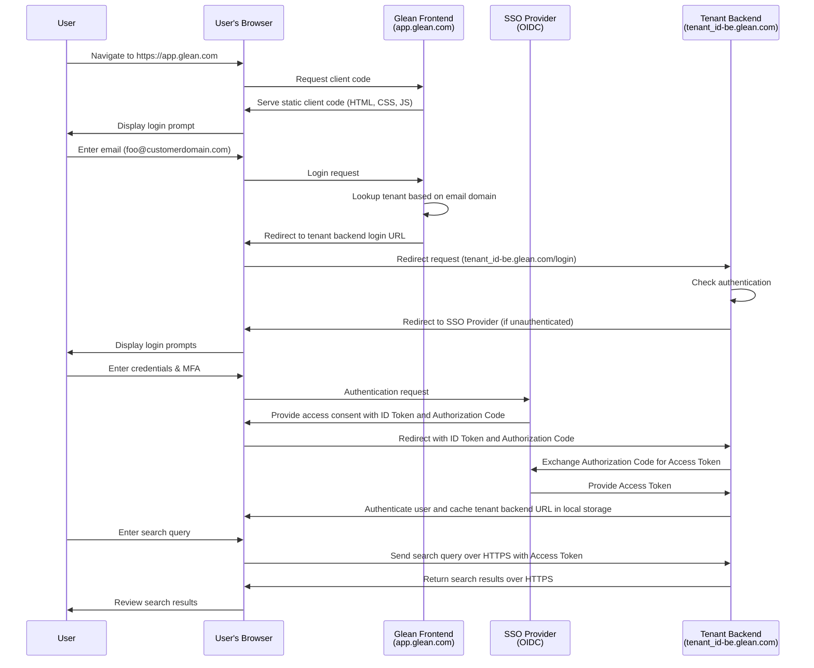

The Glean platform architecture consists of three primary components that work together to provide secure and effective enterprise data access:

<CardGroup cols={3}>
  <Card title="Query Path" icon="magnifying-glass">
    Handles user search requests and authentication
  </Card>
  <Card title="Data Ingestion Path" icon="database">
    Manages data collection from enterprise sources
  </Card>
  <Card title="Data Processing Pipeline" icon="gears">
    Processes and indexes collected data
  </Card>
</CardGroup>

## Query Path

### Web Application Overview

<Steps>
  <Step title="Initial Access">
    Users access Glean through the web application at [https://app.glean.com](https://app.glean.com), hosted within Glean's central cloud infrastructure. The application serves static assets including images, CSS, and JavaScript.
  </Step>

  <Step title="Session Check">
    The web client checks for an existing session state in the user's local storage. If none exists, authentication is required as anonymous searching is not supported.
  </Step>

  <Step title="Authentication Process">
    Users begin by entering their email address (e.g., `user@company.com`).
    
    <Frame>
      
    </Frame>
  </Step>
</Steps>

### Tenant Resolution

<Info>
Each customer tenant requires a list of company domain names for authentication. These domains are mapped to a tenant-specific Query Endpoint (QE) of the form `<tenant_id>-be.glean.com`.
</Info>

The authentication process follows these steps:

<Steps>
  <Step title="Domain Lookup">
    When a user submits their email, the web app performs a domain lookup to determine the appropriate QE domain.
    
    <Frame>
      
    </Frame>
  </Step>

  <Step title="QE Assignment">
    The QE domain resolves to a static IP uniquely assigned to your company's Glean tenant, whether deployed in Glean SaaS or your own cloud environment.
    
    <Frame>
      
    </Frame>
  </Step>

  <Step title="SSO Integration">
    Unauthenticated users are redirected to your configured SSO provider for authentication.
    
    <Frame>
      
    </Frame>
  </Step>
</Steps>

### Authentication Flow Diagram

The following diagram illustrates the complete process from initial access to query execution:



### Query Endpoint Communication

When users perform searches, requests are sent to:
```
https://<tenant_id>-be.glean.com/api/v1/search
```

<AccordionGroup>
  <Accordion title="Example Request Header">
    ```json
    {
        "cursor": "[...snip...]",
        "maxSnippetSize": 324,
        "pageSize": 10,
        "people": [],
        "query": "expense policy",
        "requestOptions": {
            "debugOptions": {},
            "disableQueryAutocorrect": false,
            "facetBucketSize": 0,
            "facetFilters": [],
            "timezoneOffset": -660
        },
        "sc": "",
        "sessionInfo": {
            "lastSeen": "2023-12-13T05:03:49.808Z",
            "sessionTrackingToken": "[...snip...]",
            "lastQuery": "expense policy"
        },
        "sourceInfo": {
            "clientVersion": "fe-release-2023-12-05-86ae10d",
            "initiator": "MORE",
            "modality": "FULLPAGE"
        },
        "timeoutMillis": 10000,
        "timestamp": "2023-12-13T05:04:14.093Z",
        "trackingToken": "[...snip...]"
    }
    ```
  </Accordion>

  <Accordion title="Example Response">
    ```json
    {
        "trackingToken": "[...snip...]",
        "sessionInfo": {
            "sessionTrackingToken": "[...snip...]",
            "lastSeen": "2023-12-13T05:04:14.385838873Z",
            "lastQuery": "expense policy"
        },
        "results": [
            {
                "trackingToken": "[...snip...]",
                "document": {
                    "id": "GDRIVE_11[...snip...]Kp-P",
                    "datasource": "gdrive",
                    "docType": "pdf",
                    "parentDocument": {
                        "id": "GDRIVE_1t[...snip...]qqsy",
                        "datasource": "gdrive",
                        "docType": "Folder",
                        "title": "Company Policies",
                        "url": "https://drive.google.com/drive/folders/1t[...snip...]qqsy"
                    },
                    "title": "CompanyExpensePolicy-sept2023.pdf",
                    "url": "https://drive.google.com/file/d/11[...snip...]Kp-P",
                    "metadata": {
                        "datasource": "gdrive",
                        "datasourceInstance": "gdrive",
                        "objectType": "pdf",
                        "container": "Insurance Policies",
                        "containerId": "GDRIVE_1t[...snip...]qqsy",
                        "mimeType": "application/pdf",
                        "documentId": "GDRIVE_11f...snip...]Kp-P",
                        "createTime": "2023-06-05T20:00:25Z",
                        "updateTime": "2023-06-16T11:59:42Z",
                        "author": {
                            "name": "Sam Sample",
                            "obfuscatedId": "B79[...snip...]3D8"
                        },
                        "owner": {
                            "name": "Sam Sample",
                            "obfuscatedId": "B79[...snip...]3D8"
                        },
                        "visibility": "SPECIFIC_PEOPLE_AND_GROUPS",
                        "assignedTo": {
                            "name": "Sam Sample",
                            "obfuscatedId": "B79[...snip...]3D8"
                        },
                        "updatedBy": {
                            "name": "Sam Sample",
                            "obfuscatedId": "B79[...snip...]3D8"
                        },
                        "datasourceId": "11[...snip...]Kp-P",
                        "interactions": {},
                        "documentCategory": "COLLABORATIVE_CONTENT"
                    }
                },
                "snippets": [
                    {
                        "snippet": "",
                        "mimeType": "text/plain",
                        "text": "You can submit them to your manager using the current expense reporting method (current method here) within three months after the date of each expense. If your manager approves your expenses, you will receive your reimbursement within two pay periods on your regular paycheck."
                    }
                ]
            }
        ]
    }
    ```
  </Accordion>
</AccordionGroup>

<Card title="API Documentation" icon="book" href="https://developers.glean.com/client/operation/search/">
  Find detailed field descriptions in our Developer Documentation
</Card>

## Data Ingestion Flow

Glean's data ingestion process is built around specialized connectors deployed within your tenant's dedicated cloud project. These connectors serve multiple purposes:

<CardGroup cols={3}>
  <Card title="Content Retrieval" icon="file-arrow-down">
    Fetches content from connected enterprise sources
  </Card>
  <Card title="Activity Tracking" icon="chart-line">
    Monitors user interaction data
  </Card>
  <Card title="Permission Mapping" icon="lock">
    Maps and maintains access controls
  </Card>
</CardGroup>

### Connection Methods

<Info>
Data retrieval occurs via HTTPS, with two primary connection patterns depending on the data source location.
</Info>

<CardGroup cols={2}>
  <Card title="SaaS Applications" icon="cloud">
    For services like Google Drive, connections occur over the public internet using HTTPS
  </Card>
  <Card title="On-Premises Systems" icon="server">
    For internal systems like on-prem Jira, secure private connections are established via VPN or Shared VPC
  </Card>
</CardGroup>

## Data Processing Pipelines

<Warning>
All data processing occurs within your tenant's project using Google Dataflow pipelines. Your data never leaves your tenant's environment.
</Warning>

The processing pipeline combines:
- Content from connected sources
- Permission mappings
- User data
- Activity metrics (creation, edits, views)

This combined data is then indexed to create a secure, searchable knowledge base within your tenant.