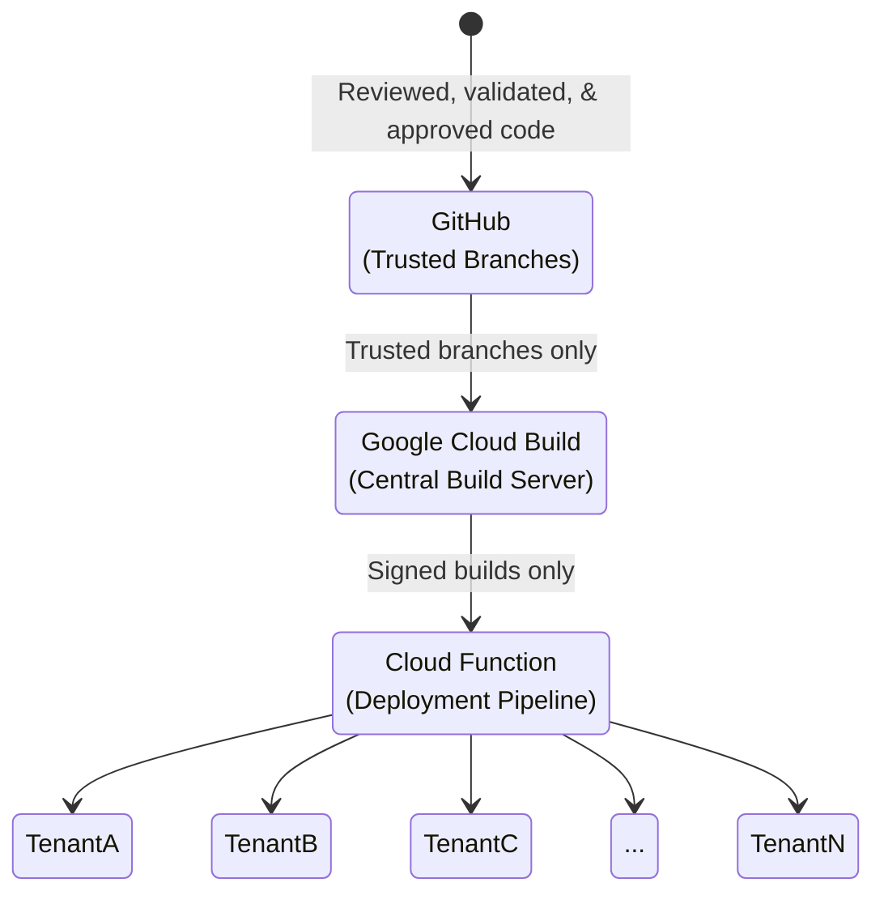

Glean maintains a robust upgrade model designed to ensure customers always have access to the latest features while maintaining the highest standards of security, privacy, and reliability. Our Software Development Lifecycle (SDLC) follows strict processes to ensure only trusted and verified code runs in customer deployments.

## Trust Chain Overview

Our SDLC implements a comprehensive chain of trust that governs code from development through deployment:

## Development and Deployment Process

### Code Management

<CardGroup cols={2}>
  <Card title="Protected Branches" icon="code-branch">
    Release branches are protected and only accept reviewed code through signed commits
  </Card>
  <Card title="Vulnerability Scanning" icon="shield-check">
    Continuous GitHub Vulnerability Scanning assists in early detection of potential security issues
  </Card>
</CardGroup>

### Build Process

<Steps>
  <Step title="Central Build Service">
    A locked-down build service implemented using Google Cloud Build periodically fetches code from trusted GitHub branches
  </Step>
  
  <Step title="Container Building">
    The service builds Docker containers and signs them using binary authorization, with access restricted to specified Glean engineers
  </Step>
  
  <Step title="Security Scanning">
    Multiple scanning tools are employed during the build process:
    - Google Cloud Platform Web Security Scanner
    - GCP Assets Scanner
    - GCP Container Registry Scanner
  </Step>
</Steps>

### Quality Assurance

<Info>
All releases undergo comprehensive testing in separate tenancies before customer deployment. No production or customer data is ever used in testing.
</Info>

Our QA process includes:
<CardGroup cols={2}>
  <Card title="Internal Soak Testing" icon="vial">
    Extended testing period to ensure stability
  </Card>
  <Card title="Automated Testing" icon="robot">
    Comprehensive automated test suites
  </Card>
  <Card title="Manual Testing" icon="user-check">
    Thorough manual verification procedures
  </Card>
  <Card title="Security Testing" icon="shield">
    P0 security and permissions testing
  </Card>
</CardGroup>

### Deployment Process

<Steps>
  <Step title="Central Workflow">
    The deployment workflow can only invoke specific Cloud Functions within customer tenants
  </Step>
  
  <Step title="Release Specification">
    Cloud Functions accept only the name of the approved release for upgrade
  </Step>
  
  <Step title="Self-Upgrade">
    The system self-upgrades by downloading the signed release from a trusted location and verifying integrity through binary authorization
  </Step>
</Steps>

## Security Measures

### Access Control

<AccordionGroup>
  <Accordion title="Employee Authentication">
    Glean implements:
    - Single Sign-On (SSO) with Multi-Factor Authentication (MFA)
    - 24-hour authentication sessions
    - Mandatory re-authentication after session expiry
  </Accordion>
  
  <Accordion title="Repository Access">
    Access controls include:
    - Limited engineer access to private GitHub repositories
    - Restricted IAM permissions for build triggers
    - Separation of build trigger and pipeline modification permissions
  </Accordion>
</AccordionGroup>

### Security Testing and Compliance

<CardGroup cols={2}>
  <Card title="Security Exercises" icon="shield-halved">
    Regular tabletop exercises identify and address potential threats, complemented by periodic penetration testing through Cobalt
  </Card>
  
  <Card title="Compliance Standards" icon="certificate">
    Glean maintains SOC2 Type II compliance
  </Card>
</CardGroup>

<Note>
Detailed reports including the latest penetration test results and full SOC2 Type II documentation are available under NDA through your Glean account team.
</Note>
