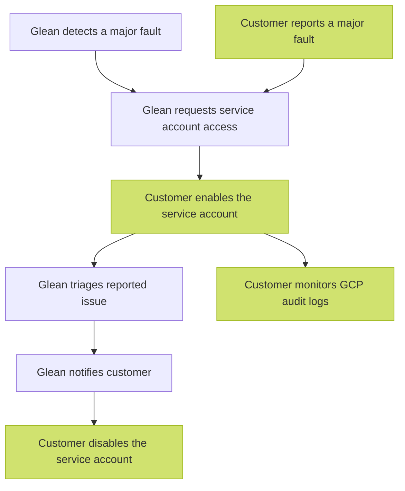

When deploying Glean within your organization's Google Cloud Platform (GCP) environment, Glean mandates the creation of a Service Account with Owner role permissions so that our build systems can deploy your tenant.

This document outlines the purpose of the service account, how Glean utilizes it, and best practices for managing it securely.

## About the GCP Service Account with Owner Role

The GCP service account with the Owner role provides comprehensive access to manage all infrastructure and data within the GCP project where Glean is hosted.

As part of the build process for your tenant, Glean requires that a service account with owner role privileges be created. This account is used by Glean's automated build pipelines to deploy your Glean tenant within the designated project.

Access to the service account is granted to Glean through a JSON key, which is securely uploaded via the Glean user interface.

<Info>
A service account that is generated with an owner role for a specific project in Google Cloud Platform (GCP) is limited to the resources and services within that specific project. **It does not have permissions to access or modify resources outside of the project, even within the same GCP tenant.**

The permissions of a service account are defined by the roles that are granted to it. **The owner role grants full access to all resources in the project where it is assigned, but it does not extend to other projects in the GCP tenant.**
</Info>

<Warning>
Glean cannot deploy your tenant without the owner role, as it enables our build system to create all necessary resources for the Glean platform within the project. This includes instances, storage, databases, workflows, dashboards, networking, and security configurations.

Creating these resources manually is not possible. Glean employs Infrastructure as Code (IaC) to maintain the integrity and consistency of our deployments. Manually creating resources would not only be time-consuming and error-prone, but also circumvents our automated deployment and configuration processes, which are designed to ensure consistency, reliability, and security across all Glean deployments.
</Warning>

## Managing Service Account Access

The Service Account with Owner Role is crucial for Glean's build systems during the initial setup, deployment, and troubleshooting phases. Once the system reaches a steady state and is ready for use, you may opt to disable the account, although Glean does not recommend this.

Disabling the account (e.g., `glean-admin@<gcp project name>.iam.gserviceaccount.com`) will revoke Glean's access to the GCP components that store sensitive company data, such as the CloudSQL databases and the Kubernetes cluster.

For serious infrastructure issues, Glean may require time-bound access to the service account for inspection, repair, or restoration. In this scenario, access is limited to senior Glean Engineering or Support team members and must be documented and approved by Glean management. All actions performed by Glean staff are recorded within the audit logs of the GCP project. Glean encourages regular monitoring of these logs and endorses GCP's guidance on [monitoring service account usage patterns](https://cloud.google.com/iam/docs/service-account-monitoring).

<Warning>
Failure to provide Glean with timely access to your environment for support or remediation activities may invalidate any Service Level Agreements (SLAs) in place with Glean.
</Warning>

## Establishing Joint Access Procedures

Glean Engineering or Support may require access to the GCP service account with Owner role for incident remediation or issue investigation. A joint access process should be established and tested between your company and Glean before Glean's launch.

The following diagram outlines the key steps involved with starting and closing the loop for access to the service account.

## Disabling and Enabling the Service Account

<Steps>
  <Step title="Navigate to IAM and Admin">
    In the Google Cloud Console for the Glean project, navigate to [IAM and Admin > Service accounts](https://console.cloud.google.com/iam-admin/serviceaccounts).
  </Step>
  <Step title="Find the service account">
    Use the Filter box to find the service account (e.g. `glean-admin`).
  </Step>
  <Step title="Access menu">
    Click the three vertical dots on the right side to open the menu.
  </Step>
  <Step title="Toggle status">
    Select **Disable** or **Enable** as needed and confirm in the modal that appears.
  </Step>
</Steps>

<Frame>
  
</Frame>

## Recreating the Service Account

<Warning>
Do not deliberately remove the service account.
</Warning>

If the service account has been removed in error, follow these steps to recreate it:

<Steps>
  <Step title="Navigate to Service Accounts">
    In the Google Cloud Console for the Glean project, navigate to [IAM and Admin > Service accounts](https://console.cloud.google.com/iam-admin/serviceaccounts).
  </Step>
  <Step title="Create new service account">
    Click **Create Service Account**, enter a name for the service account (e.g. `glean-admin`), and click **Create and Continue**.
    <Frame>
      
    </Frame>
  </Step>
  <Step title="Grant Owner role">
    Under the **Grant this service account access to project** section, select the **Owner** role from the list and click **Continue**.
    <Frame>
      
    </Frame>
  </Step>
  <Step title="Complete creation">
    Skip to the bottom and click **Done**.
  </Step>
  <Step title="Manage keys">
    On the next page, search for the service account name you just created, e.g. `glean-admin`. Click the three vertical dots on the right side to open the menu, and select **Manage Keys**.
    <Frame>
      
    </Frame>
  </Step>
  <Step title="Create new key">
    Click **Create New Key**, select **JSON** as the format, and click **Create**.
    <Frame>
      
    </Frame>
    <Frame>
      
    </Frame>
  </Step>
  <Step title="Share key securely">
    Download the key to your machine and share it with Glean using a secure communication channel.
  </Step>
</Steps>

<Accordion title="How does Glean securely store the account key?">
Glean stores the service account key in an encrypted format within a HashiCorp Vault server. The key remains on this server and is never exposed. 

Temporary one-hour access can be granted to a select group of senior Glean Engineering team members upon approval by Glean management, and only in response to a significant fault reported within the Glean environment. All access to the vault is audit-logged, requires an appropriate IAM role, and is secured with Single Sign-On (SSO) and Multi-Factor Authentication (MFA).

All access by Glean staff to your environment in this manner is audit logged within the GCP project. Glean encourages continuous monitoring of these logs and endorses Google's guidance on [monitoring service account usage patterns](https://cloud.google.com/iam/docs/service-account-monitoring) to enhance security and oversight.
</Accordion>
