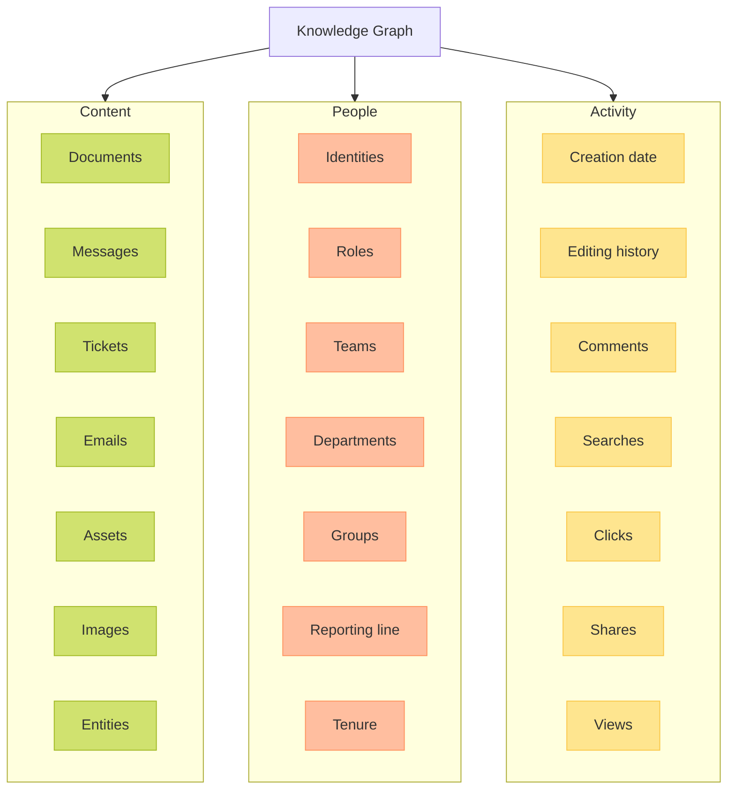
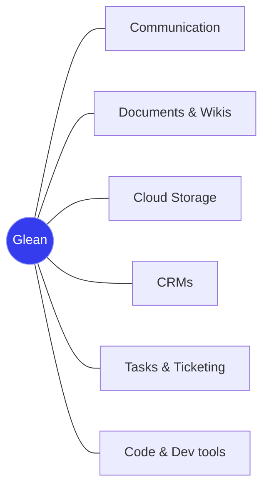

The Glean Knowledge Graph serves as the foundation of Glean's enterprise search platform, operating on a real-time model of your enterprise's indexed information. This sophisticated system enables highly personalized and contextually relevant search results by understanding the relationships between content, people, and activities within your organization.

## Core Architecture

The Knowledge Graph is built on three fundamental pillars that work together to create a comprehensive understanding of your enterprise data:

<CardGroup cols={3}>
  <Card title="Content" icon="file-lines">
    Documents, messages, tickets, and other content types across your organization
  </Card>
  <Card title="People" icon="users">
    User identities, roles, teams, and organizational relationships
  </Card>
  <Card title="Activity" icon="chart-line">
    User interactions, document history, and engagement patterns
  </Card>
</CardGroup>

## Content Integration

<Info>
  Glean provides over 100 easy-to-use connectors, each specifically designed for different applications' data models and API endpoints.
</Info>

The content crawler performs comprehensive indexing that includes:
- Full content analysis (titles, body copy, comments, media)
- Metadata extraction (creator, creation time, update history, file type, folder structure)
- Permissions management
- Customizable search weights
- Faceted search capabilities

### Crawl Configuration

<AccordionGroup>
  <Accordion title="Customizable Weights">
    Set specific weights for different content categories to influence search result relevance.
  </Accordion>
  
  <Accordion title="Permissions Control">
    Configure access at the individual item level and specify inclusion/exclusion rules by asset IDs or item containers.
  </Accordion>
  
  <Accordion title="Crawl Strategy">
    Adjust crawl parameters to match your organization's needs:
    - Customizable crawl frequency
    - Blackout period settings
    - Multiple crawl methodology options
  </Accordion>
</AccordionGroup>

## People Intelligence

<Info>
One in ten enterprise searches are people-related, making comprehensive people data crucial for effective enterprise search.
</Info>

<Frame caption="Glean's Knowledge Graph provides rich people insights">
  
</Frame>

The People pillar of the Knowledge Graph provides:

<Steps>
  <Step title="Unified Identity">
    Creates a consolidated view of each person across all connected applications.
  </Step>
  <Step title="Organizational Context">
    Maps relationships between roles, teams, tenure, and location.
  </Step>
  <Step title="Collaboration Insights">
    Identifies close collaborators and recent project involvement.
  </Step>
  <Step title="Customizable Profiles">
    Flexible data model that can be tailored to your organization's needs.
  </Step>
</Steps>

## Activity Tracking

<Info>
Activity data is collected securely from connected applications to enhance search personalization and relevance.
</Info>

Activity data is collected from multiple sources:
- Teams
- Slack
- Email
- Plugins
- Chrome extension

### Data Usage and Privacy

The activity information serves two primary purposes:

<CardGroup cols={2}>
  <Card title="Individual Personalization" icon="user">
    Learning patterns to improve personal search results while maintaining strict user privacy - individual data remains isolated to each user.
  </Card>
  <Card title="Collective Intelligence" icon="users-line">
    Enhancing results for user groups through aggregated insights, with privacy thresholds ensuring data collection only occurs across multiple users.
  </Card>
</CardGroup>

<Note>
Activity data never leaves your exclusive GCP project and is subject to strict data protection rules to ensure privacy.
</Note>
